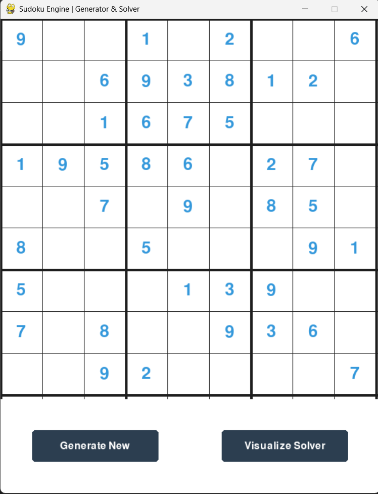

# Sudoku Engine & Visualizer 🧩
**SkillCraft Technology Internship | Task 03**


## 📋 Description
A high-performance Sudoku Solver and Generator built with Python and PyGame.

Unlike simple text-based solvers, this application **visualizes the Backtracking Algorithm** in real-time. It demonstrates how Artificial Intelligence approaches Constraint Satisfaction Problems (CSP) by recursively testing numbers, validating constraints, and backtracking upon hitting dead ends.

## ✨ Key Features
* **🧠 Procedural Generation:** Generates valid, unique Sudoku puzzles on the fly using randomized diagonal seeding.
* **⚡ Real-Time Visualization:** Watch the AI "think" as it explores paths (Green) and backtracks from errors (Red).
* **🎮 Interactive UI:** Clean interface with buttons to generate new puzzles or start the solver instantly.
* **🛡️ Robust Logic:** Guarantees 100% solvable puzzles every time.

## 📸 Screenshots & Demo

### The Algorithm in Action


### 🎥 [Watch the Visualization Demo](docs/demo_video/demo_video.mp4)

## ⚙️ Algorithm Explained
This engine uses the **Backtracking Algorithm**, a depth-first search strategy:
1.  **Find Empty Cell:** The solver scans the grid for the next `0` (empty cell).
2.  **Try Number:** It tentatively places a number (1-9).
3.  **Validate:** It checks row, column, and 3x3 box constraints.
4.  **Recurse:** If valid, it moves to the next cell.
5.  **Backtrack:** If a dead end is reached, it resets the cell to `0` and tries the next number.

**Time Complexity:** O(9^m) where *m* is the number of empty cells.

## 🛠️ Installation & Run
1.  **Clone the repository:**
    ```bash
    git clone [https://github.com/Adithyanps47/SCT_SE_3.git](https://github.com/Adithyanps47/SCT_SE_3.git)
    cd SCT_SE_3
    ```

2.  **Install dependencies:**
    ```bash
    pip install -r requirements.txt
    ```

3.  **Run the Engine:**
    ```bash
    python sudoku_solver.py
    ```

## 📂 Project Structure
* `sudoku_solver.py`: Core logic for generation and solving.
* `requirements.txt`: Dependencies list.
* `docs/`: Contains screenshots and demo videos.

## 👨‍💻 Author
**Adithyan P S**
* **Role:** Software Engineering Intern
* **LinkedIn:** [Adithyan P S](https://www.linkedin.com/in/adithyan-p-s-mobile/)
* **GitHub:** [@Adithyanps47](https://github.com/Adithyanps47)

---
*Developed for SkillCraft Technology Internship | Task 03*
